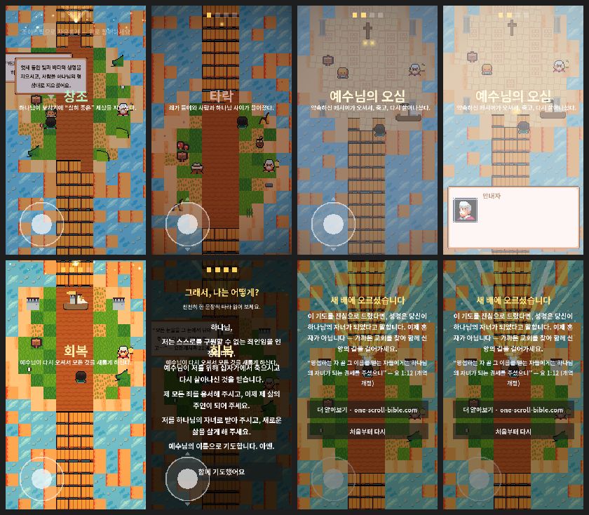

# 한눈에 보는 성경 이야기 — 항해 (Bible in One Scroll · The Voyage)

[one-scroll-bible.com](https://one-scroll-bible.com/) 의 **구속사 스크롤을 게임화**한 모바일 픽셀 게임.
위로 항해하며 **창조 → 타락 → … → 예수님 → 회복** 기항지를 지나고, **예수님 항구에서
“사실 당신은 해적선에 타고 있었다”는 반전**을 만난 뒤, **항구에서 구조선으로 갈아타며
영접 기도**로 이어집니다. (해적선 → 배 갈아타기 프레임은 사이트 FAQ의 **골 1:13 “옮기셨으니”** 비유.)

## ▶ 플레이

- **웹(브라우저, 모바일/PC):** https://jungrok5.github.io/one-scroll-bible-game/
- **안드로이드 APK:** [최신 릴리스](https://github.com/jungrok5/one-scroll-bible-game/releases/latest) 에서 `bible-voyage.apk` 다운로드 후 사이드로드
  - 패키지: `com.onescrollbible.voyage` (디버그 서명)

조작: 좌하단 **가상 조이스틱**(또는 PC에서 ↑/↓ · W/S)으로 위로 항해 → 기항지에서 말풍선 탭하여 진행.



## 게임 흐름
창조(번개 연출) → 타락 → **예수님 항구: “당신은 줄곧 해적선에 타고 있었다” 반전** →
회복 → **영접 기도**(개역개정 verbatim) → **구조선으로 갈아타며 일출 엔딩** → 사이트로 연결.

## 엔진 / 기술
- **Godot 4.6.3**, GDScript, **GL Compatibility**(웹/모바일 호환)
- 모바일 세로 **360×640**. 픽셀 스프라이트는 nearest 필터 + 2배 확대, UI는 캔버스 해상도라 또렷
- 폰트 **Noto Sans KR Bold**, 본문은 **개역개정 verbatim**

## 로컬 실행 / 빌드
1. [Godot 4.6.x](https://godotengine.org/) 로 이 폴더(`project.godot`)를 엽니다(에셋 자동 import).
2. ▶ 실행(F5).
- 웹 export: `프로젝트 → 내보내기 → Web`(프리셋 `Web`, 싱글스레드).
- APK: 프리셋 `Android`(gradle 빌드). ETC2/ASTC 필수(`project.godot` 에 설정됨).

## 구조
```
project.godot          # 모바일 세로 · nearest · GL Compatibility · ETC2
scenes/Main.tscn       # 루트(스크립트만; 월드는 코드로 구성)
scripts/
  Main.gd              # 월드 빌드 · 항구 트리거 · 연출 · 영접기도 엔딩 · 배 갈아타기
  GameData.gd          # 콘텐츠(사이트 한국어 verbatim)
  Player.gd · VirtualJoystick.gd · DialogueBox.gd · fx/LightningFX.gd
assets/                # 픽셀 스프라이트(임시 → Kenney CC0 교체 예정) · Noto Sans KR Bold
tools/
  gen_assets.py        # 플레이스홀더 스프라이트 재생성
  Autopilot.gd         # E2E 오토플레이(환경변수 E2E 있을 때만)
docs/screenshots/      # E2E 캡처 · 컨택트시트
.github/workflows/android.yml  # CI: APK 릴리스 + 웹 gh-pages 배포
```

## CI / 배포
브랜치에 push할 때마다 자동으로:
- **APK** 빌드 → **GitHub Releases** 업로드(태그 `apk-build-<run>`)
- **웹** export → **`gh-pages` 브랜치** 배포 → GitHub Pages 공개

> 최초 1회: GitHub **Settings → Pages → Source: Deploy from a branch → `gh-pages` / `(root)`** 설정 필요.

## 콘텐츠 관점 / 출처
한국 개신교 다수의 **복음주의·개혁주의 구속사 관점, 개역개정** 기준. 성경 인용은 그대로(verbatim).
스프라이트는 임시 자체 제작(추후 [Kenney](https://kenney.nl) CC0 교체), 폰트는 나눔/노토 계열(OFL).

🤖 Generated with [Claude Code](https://claude.com/claude-code)
